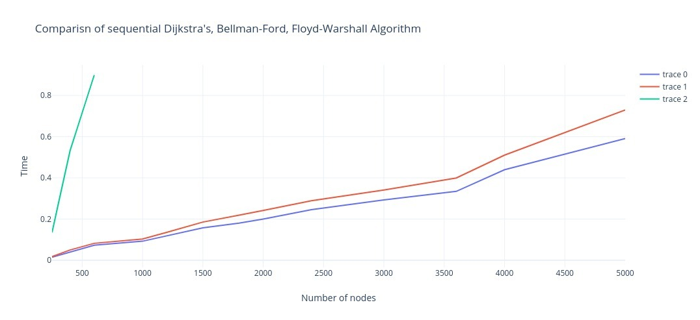

### Graph: Time Complexities of Shortest path Algorithms

### Comparison with other algorithms

There are mainly three other single source shortest path algorithms:

   - Bellman Ford: n 3
   - Floyd Warshal: n*e

