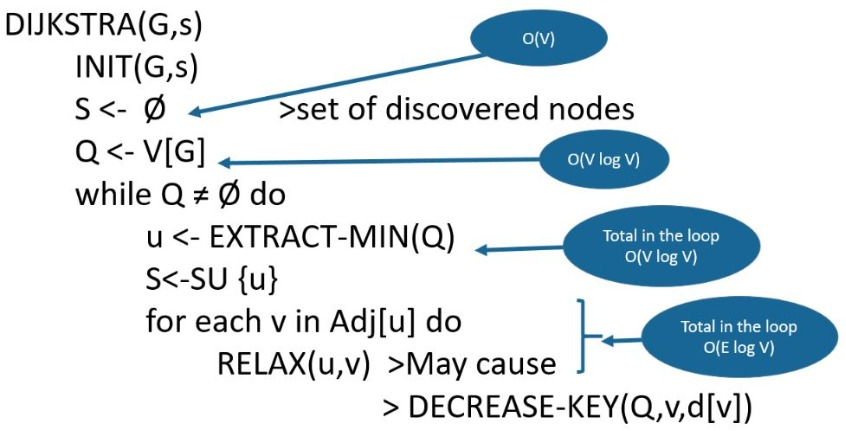

### Running Time of Dijkstra’s algorithm

The time complexity of the given code/algorithm looks O(V^2) as there are two nested while loops. If we take a closer look, we can observe that the statements in inner loop are executed O(V+E) times (similar to BFS). The inner loop has decreaseKey() operation which takes O(LogV) time. So overall time complexity is O(E+V)*O(LogV) which is O((E+V)*LogV) = O(ELogV) Note that the above code uses Binary Heap for Priority Queue implementation. Time complexity can be reduced to O(E + VLogV) using Fibonacci Heap. The reason is, Fibonacci Heap takes O(1) time for decrease-key operation while Binary Heap takes O(Logn) time.
### Best and Worst Cases for Dijkstra’s Algorithm

   - The worst case (where log denotes the binary logarithm log 2 ) for connected graphs this time bound can be simplified to Θ (|E|log⁡ |V|) . The Fibonacci heap improves this to O(|E| + |V| * log⁡ |V|).
   - When using binary heaps, the average case time complexity is lower than the worst-case: assuming edge costs are drawn independently from a common probability distribution, the expected number of decrease-key operations is bounded by O(|V| * log(|E| / |V|)), giving a total running time of O(|E| + |V| * log ⁡|E| / |V| * log⁡ |V|).

### Time complexity of Dijkstra’s Algorithm

### Space complexity of Dijkstra’s algorithm

Space complexity of Dijkstra’s algorithm is O(V2) where V denotes the number of vertices (or nodes) in the graph.

